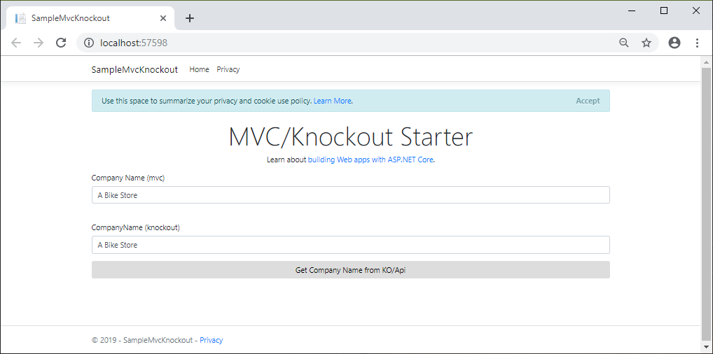
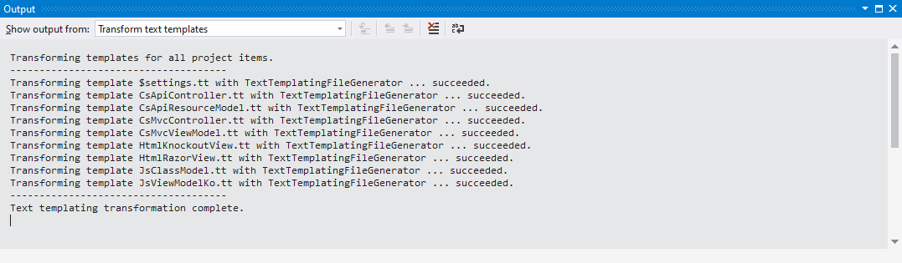

# Make-Some-Code
Writing a simple web-page that shows one single property such as CompanyName requires that you write lots of code. The journey that CompanyName makes from a column on a table all the way down to the web-page is not a trivial one. It requires that you write lots of code that is prone to error and time consuming (and boring to write). Generating all that code saves your time and allows for code that meets your expectations and standards.

## Overview

## Prerequisites

* Visual Studio 2017
* .NET Core 2.0 (https://www.microsoft.com/net/core)

## Setup Requirements to Run Local

* Open the MakeSomeCode.sln solution in Visual Studio.
* Set code-generation properties in $settings.tt
* Click Transform All T4 Templates on the Build menu
